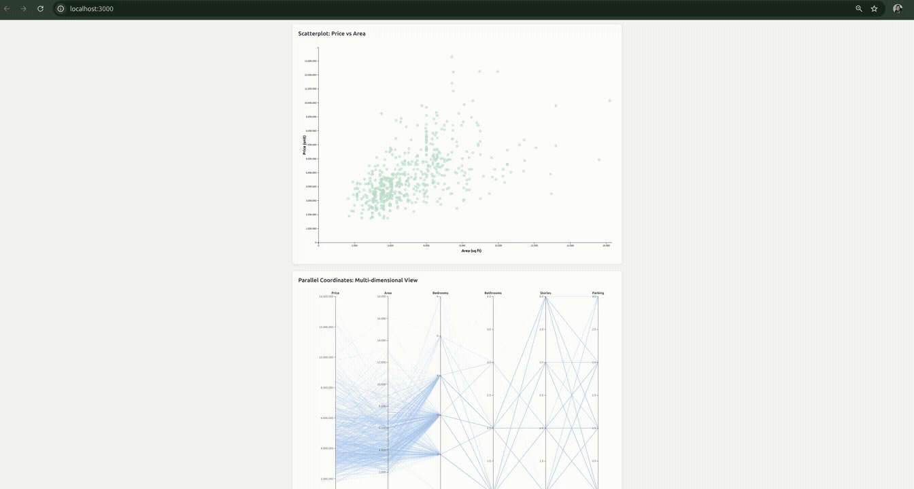

# Housing Data Interactive Visualization


[](https://opensource.org/licenses/MIT)

A synchronized dual-view interactive visualization system for exploring housing market data using **React** and **D3.js**.  
This project demonstrates advanced data visualization techniques with seamless interaction between multiple coordinated views.

## 🎥 Demo Video



*Video demonstrates the interactive features and synchronized selection capabilities.*

---

## 📊 Project Overview

This application provides an interactive exploration environment for analyzing 545 housing records across multiple dimensions including price, area, bedrooms, bathrooms, stories, and parking availability.

### Key Features

- **Dual Synchronized Views**: Two complementary visualizations update simultaneously
- **Advanced Interactions**: 2D brushing, click selection, multi-select, and hover effects
- **Real-time Synchronization**: Selections in one view instantly highlight in the other
- **Smooth Animations**: D3 enter-exit-merge pattern with 300ms transitions
- **Responsive Design**: Professional UI with modern styling

---

## 🎯 Visualizations

### 1. Scatterplot: Price vs. Area
- **Purpose**: Explore the relationship between house price and area
- **Interaction**: 2D rectangular brush selection
- **Use Cases**:
  - Identify price-area correlation
  - Detect outliers and clusters
  - Select houses in specific price/area ranges

### 2. Parallel Coordinates: Multi-dimensional View
- **Purpose**: Examine houses across six dimensions simultaneously
- **Dimensions**: Price, Area, Bedrooms, Bathrooms, Stories, Parking
- **Interactions**:
  - **Single Click**: Select individual house
  - **Ctrl+Click (Win) / Cmd+Click (Mac)**: Multi-select houses
  - **Hover**: Visual feedback with orange highlighting
- **Use Cases**:
  - Compare complete house profiles
  - Identify multi-dimensional patterns
  - Inspect specific houses in detail

---

## 🚀 Getting Started

### Prerequisites

- **Node.js** (v14 or higher)  
- **npm** or **yarn**

### Installation

```bash
# Clone the repository
git clone https://github.com/JabinTasnimUrmy/IndividualAssignment.git
cd IndividualAssignment

# Install dependencies
npm install

# Start the development server
npm start

```


The application will open at `http://localhost:3000`


---

## 🛠️ Technical Implementation

### Architecture

**React + D3 Integration:**
- **Separation of Concerns**: D3 classes handle visualization logic, React manages lifecycle
- **React Hooks**: `useState`, `useRef`, `useEffect` for state and lifecycle management
- **D3 Classes**: Separate classes (`ScatterPlotD3`, `ParallelCoordinatesD3`) encapsulate visualization logic

### Design Patterns

1. **useState**: Global state management for data and selections
2. **useRef**: Persist D3 instances across re-renders
3. **useEffect**: Handle component lifecycle (mount, update, unmount)
4. **Enter-Exit-Merge**: Efficient D3 data updates with smooth transitions

### Data Flow

User Interaction (Brush/Click)
↓
D3 Class (Calculate Selection)
↓
Callback: onBrushUpdate(selectedIds)
↓
App.js (Update State)
↓
React Re-render
↓
Both Visualizations Update


---

## 📖 Usage Guide

### Scatterplot Interactions

1. **Brush Selection**: Click and drag to create a rectangular selection region
2. **Clear Selection**: Click outside the selection or create an empty brush

### Parallel Coordinates Interactions

1. **Select Single House**: Click on any line
2. **Multi-Select**: Hold `Ctrl` (Windows) or `Cmd` (Mac) and click multiple lines
3. **Hover**: Move mouse over lines to see highlight preview
4. **View Details**: Selected houses show in red, unselected in light blue

### Synchronized Behavior

- Brushing in scatterplot → Highlights corresponding lines in parallel coordinates
- Clicking lines in parallel coordinates → Highlights corresponding points in scatterplot
- Both views always show the same selection set

---

## 📊 Dataset

**Housing.csv** (545 records)

| Attribute | Type | Range |
|-----------|------|-------|
| price | Continuous | 1.75M - 13.3M |
| area | Continuous | 1,650 - 16,200 sq ft |
| bedrooms | Discrete | 1 - 6 |
| bathrooms | Discrete | 1 - 4 |
| stories | Discrete | 1 - 4 |
| parking | Discrete | 0 - 3 |

Additional binary attributes: mainroad, guestroom, basement, hotwaterheating, airconditioning, prefarea

---

## 🎨 Visual Encoding

### Scatterplot
- **X-axis**: Area (sq ft)
- **Y-axis**: Price (Unit)
- **Color**: Red (#B91C1C) = selected, Light blue (#93c5fd) = unselected
- **Opacity**: 0.90 (selected), 0.07 (unselected), 0.28 (base)
- **Stroke Width**: 2.6px (selected), 1.15px (base)

### Parallel Coordinates
- **Axes**: 6 dimensions displayed vertically
- **Lines**: One polyline per house
- **Color Scheme**: Same as scatterplot for consistency
- **Hover**: Orange (#FF5722), 3.5px width

---


